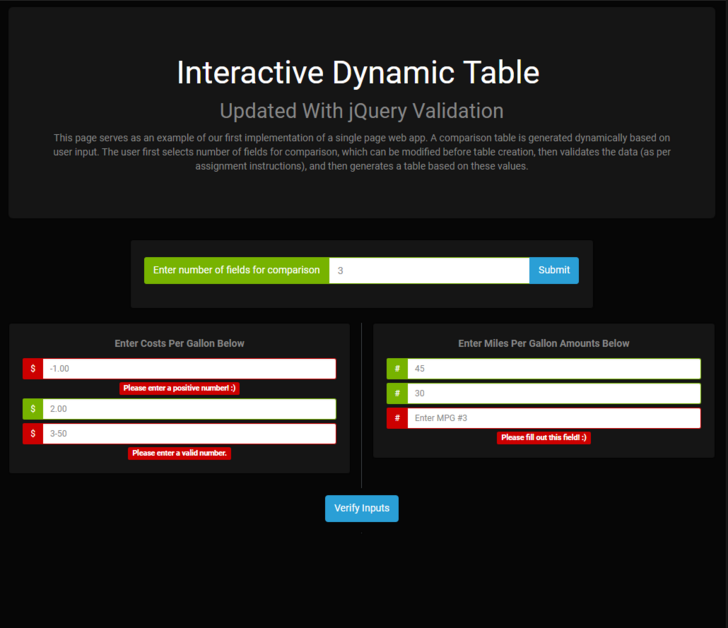

# Assignment 5
### Using the jQuery Validation Plugin with Your Dynamic Table

For this assignment, I used the [jQuery validation plugin](https://jqueryvalidation.org/) to add more efficient and robust form validation to the previous assignment. I integrated the [jQuery validator with the Bootstrap framework](https://jqueryvalidation.org/files/demo/bootstrap/index.html) to create more visually appealing errors, as shown below.

